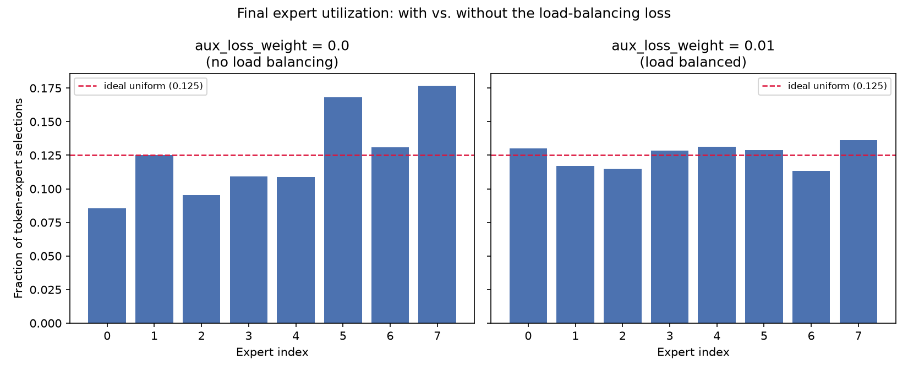
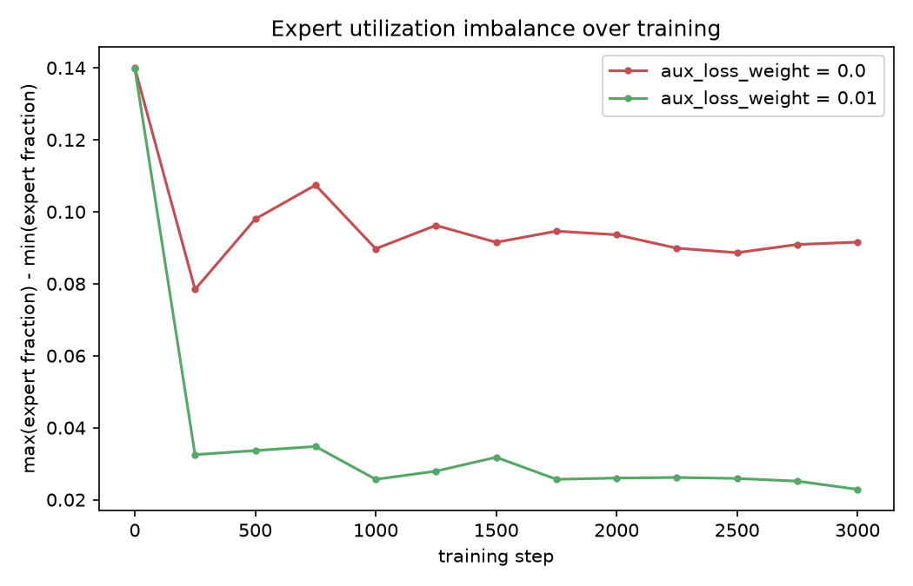

# Sparse MoE Transformer, from scratch

I wanted to actually understand how Mixture-of-Experts transformers work -- not "I called
`num_experts=8` in a config file," but "I know why the router loss is shaped the way it is
because I derived it and then watched it fix a real problem I created." So this is a small
GPT built up in four stages, each one runnable and checkable on its own before moving to the
next:

1. A normal dense decoder-only transformer (RoPE, pre-RMSNorm, causal attention) -- train it,
   generate from it, make sure the foundation actually works.
2. Rip out the FFN and replace it with 8 experts and top-2 routing. No fancy loss yet -- just
   "does routing work at all."
3. Add the load-balancing loss and router z-loss that MoE papers always mention and rarely
   show you the effect of.
4. Actually run the "with vs. without" comparison and look at the histograms, instead of
   taking it on faith that load balancing matters.

Everything below is real output from runs on my own machine (a Mac, using the MPS backend),
not made-up numbers.

## Quickstart

```bash
python3 -m venv .venv && source .venv/bin/activate
pip install -r requirements.txt
python data/prepare_data.py                                        # grabs TinyShakespeare, builds char vocab

python train.py                                                    # Step 1: dense baseline
python generate.py --ckpt checkpoints/dense/ckpt.pt --prompt "ROMEO:"

python train.py --use_moe --aux_loss_weight 0.01                   # Step 2+3: MoE, load-balanced
python ablation.py                                                  # Step 4: the actual comparison
```

## Step 1 -- does the base transformer even work?

Nothing exotic here: fused QKV attention, RoPE applied to q/k inside attention (not a separate
positional embedding table), pre-RMSNorm residual blocks, weight tying between the embedding
and output head. I wrote attention manually rather than calling
`F.scaled_dot_product_attention`, purely because I wanted every step -- the mask, the softmax,
the scaling -- visible while I was building this, not hidden in a fused kernel.

One tokenizer decision worth calling out: I went **character-level**, not BPE. TinyShakespeare
is small, the point of this project is the MoE layer and not the tokenizer, and char-level
means zero extra moving parts (no merge tables, no external dependency) at the cost of ~4x
longer sequences for the same text. Full tradeoff reasoning is in `data/prepare_data.py`'s
docstring if you want it.

**Did it work?** 4.74M params, 3000 steps, ~7 minutes. Val loss bottomed at **1.49** (perplexity
~4.5) before it started mildly overfitting -- expected on a dataset this small. And it actually
writes Shakespeare-shaped text:

> ROMEO:\
> What entent'st thou must not choosing the other.
>
> GLOUCESTER:\
> What, with you? that was your worshipful witch?

Good enough to trust the foundation and move on.

## Step 2 -- swap the FFN for 8 experts, top-2 routing

`model/moe.py` replaces the dense FFN with a router (`Linear(d_model, 8)`) and 8 smaller
copies of the same FFN shape. Each token's top-2 experts get computed, weighted by their
(renormalized) router softmax scores, and combined. No capacity limit -- every token's chosen
experts always run, however many other tokens picked the same ones. At this scale that's the
right call: capacity-based token dropping (real Switch Transformer behavior) adds a fair
amount of masking complexity for zero compute benefit when your model has 14M parameters.

I sized each expert at `expert_d_ff=512`, half the dense FFN's width, on purpose: with top-2
of 8 experts active, a token's *active* compute per forward pass lands in the same ballpark as
Step 1's dense FFN, even though the *total* parameter count is ~4x bigger. That gap between
"active compute" and "total capacity" is the entire premise of MoE.

**Did it work?** Yes, but not for free. 14.19M params, same 3000 steps. Val loss actually came
in slightly *worse* than the dense model (1.53 vs 1.49) -- with way more capacity and nothing
telling the router to spread load, it just overfits the small training set harder (train loss
hit 0.87 vs. dense's 1.07). And sure enough, expert usage settled into a stable, uneven pattern
almost immediately and never recovered: `[0.09, 0.13, 0.11, 0.10, 0.11, 0.17, 0.12, 0.16]`
against an ideal of 0.125 each. Experts 5 and 7 were doing ~1.8x expert 0's work, for the whole
rest of training. That's the exact motivation for Step 3, not a hypothetical one.

## Step 3 -- the load-balancing loss + router z-loss

Two terms, added in `model/moe.py::compute_aux_losses`, computed per MoE layer and then
averaged across layers (a well-balanced layer shouldn't be able to statistically cover for a
badly imbalanced one):

- **Load-balancing loss**, generalized from Switch Transformer's top-1 formula to top-k: for
  each expert, take `f_e` (fraction of tokens that picked it -- a hard, non-differentiable
  count from the actual routing decision) times `P_e` (the router's average softmax
  probability on it -- differentiable), sum over experts, scale by `n_experts`. Since `f_e`
  carries no gradient, all the pressure flows through `P_e`: minimizing this loss pushes the
  router's probability *down* on experts that are already getting picked too often.
- **Router z-loss** (from the ST-MoE paper): `mean(logsumexp(router_logits)²)`. Keeps the
  router's logits from growing unbounded, which would otherwise make routing more and more
  overconfident and actively fight the balancing loss.

Before trusting any training curve, I checked both formulas against what they should equal at
initialization, when the router is basically random/uniform: `aux_loss` came out to `2.2022`
against a theoretical minimum of exactly `2.0` for top_k=2, and `z_loss` came out to `4.6755`
against `log(8)² ≈ 4.32`. Close enough on both to trust the implementation before looking at
anything downstream.

## Step 4 -- does it actually fix anything?

This is the part that made the whole exercise worth it. Two identical runs -- same seed, same
`z_loss_weight=0.001`, same everything -- except `aux_loss_weight`: `0.0` vs `0.01`.

<p align="center">
  
</p>

| | no balancing (0.0) | balanced (0.01) |
|---|---|---|
| final expert utilization | `[.085, .125, .095, .109, .109, .168, .131, .177]` | `[.130, .117, .115, .129, .131, .129, .113, .136]` |
| max-min spread | 0.092 | **0.023** -- about 4x tighter |
| val perplexity | 5.57 | 5.75 |

<p align="center">
  
</p>

The unbalanced run's imbalance shows up almost immediately and then just... stays, for all
3000 steps. The balanced run converges to close-to-uniform by step ~250 and holds it. That's
the whole point of the loss, working exactly as advertised.

**The part I want to be upfront about:** the balanced run's validation perplexity is very
slightly *worse* (5.75 vs. 5.57). That's a genuine result, not a mistake I'm hand-waving away
-- forcing routing toward uniform is a constraint, and on a dataset this small (1M characters,
8 experts) there just isn't enough data for the balanced capacity to earn back that constraint
in raw perplexity. The real-world case for load balancing was never "it always lowers loss" --
it's avoiding *expert collapse*: capacity going permanently unused, and in an actual
multi-GPU deployment, some devices sitting idle while others bottleneck. At this scale, with
top-2 (not top-1) routing, "collapse" looked like a persistent ~2x skew rather than experts
dropping to near-zero -- I'd expect a sharper collapse with top-1 routing or a longer run on a
bigger model.

## Design decisions, and why

- **Character-level tokenizer** over BPE -- see Step 1 above / `data/prepare_data.py`.
- **RoPE, not learned position embeddings** -- applied to q/k inside attention (`model/rope.py`).
- **Pre-RMSNorm** (`x = x + Sublayer(RMSNorm(x))`) over the original post-norm Transformer --
  keeps the residual stream well-behaved as depth increases; it's what LLaMA/PaLM-style models
  do now instead of GPT-2's original recipe.
- **No expert capacity limit / token dropping** -- simpler, and at this scale there's no compute
  reason to add it. See Step 2.
- **Weight tying** between the token embedding and the LM head, standard since GPT-2.

## Repo layout

```
model/
  config.py     one dataclass for every hyperparameter (base model + MoE, from the start)
  rope.py       rotary position embeddings
  norm.py       RMSNorm
  attention.py  causal multi-head self-attention w/ RoPE, written out by hand
  mlp.py        the dense 2-layer FFN (Step 1's FFN, and the shape each expert takes)
  moe.py        the MoE layer + the load-balancing/z-loss math (Steps 2-3)
  block.py      one transformer block (pre-norm attn + FFN/MoE)
  gpt.py        embedding -> blocks -> norm -> head, plus .generate()
data/
  prepare_data.py   downloads + tokenizes TinyShakespeare
utils/
  scheduler.py  cosine LR schedule with linear warmup
train.py        training loop for both dense and MoE models
generate.py     sample text from a checkpoint
ablation.py     Step 4: runs both configs, plots the comparison
```

## If I kept going

- Expert-capacity-based token dropping, to see actual Switch-style collapse (all the way to
  near-zero utilization) rather than the milder skew top-2 routing produces here.
- A real subword tokenizer, to see whether the load-balancing story changes once sequences
  carry more information per token.
- Scaling up (`d_model`, `n_layers`, dataset size) to see whether the perplexity gap in Step 4
  closes, stays flat, or reverses -- my guess is it closes, but I haven't run it.
